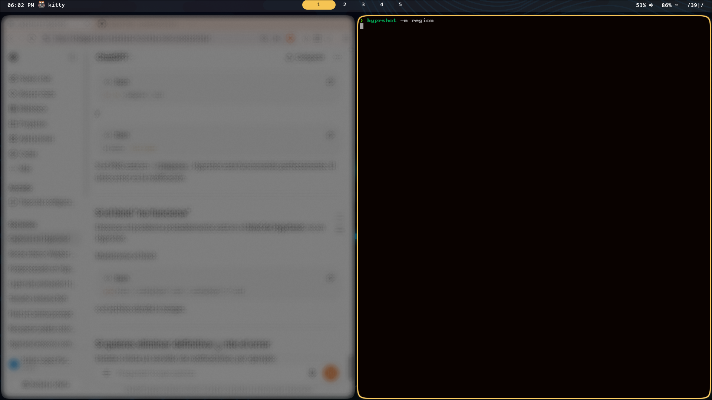

My bar consists of three sections:

left { 
    clock,
    focus app
},

middle {
    hyprland workspaces 
},

right {
    volume, 
    network, 
    battery 
}

Why it is write like code? idk, but. What I need in my laptop? clock, current workspace and because It is a laptop I need the battery level.
Anything else it is vanity, If you are vain you can add more modules of waybar.

I want to thank this video:
https://youtu.be/OSUgP7MBg7c?si=L_0SGe0sKHgkm-hh

There talk how to do the waybar config.jsonc: It is copy-paste the wiki and adjust it to you:
https://github.com/Alexays/Waybar/wiki/

And how create your style with css "style.css"

Thank you for read. If something is out of balance and bothers you, it probably bothers me too, make an issue and comment on it.
